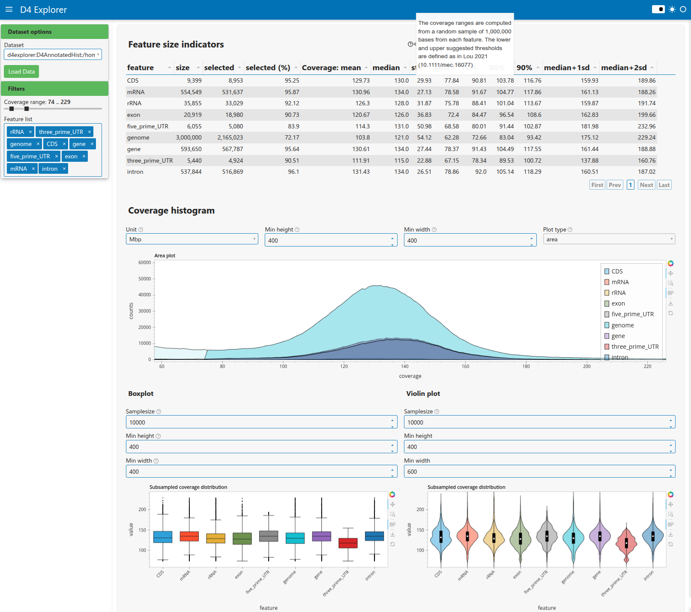

# d4explorer

Simple interactive application to plot coverage data in [d4] format.
The main purpose is to provide a tool for selecting coverage
thresholds that define accessible sites in a non-model organism
resequencing project for which it may be difficult to generate all
sites VCF output.

## Quickstart

Install `d4explorer` from `github`:

    python -m pip install "d4explorer @ git+https://github.com/percyfal/d4explorer"

Then you need to run the `preprocess`command to process one or
multiple d4 files.

    d4explorer preprocess file1.d4 file2.d4 ...

This will run `d4 hist` behind the scenes to generate a d4 histogram
file which subsequently will be stored in the d4explorer cache (by
default directory `cache`).

Adding an annotation file to the preprocessing step will furthermore
stratify results along regions:

    d4explorer preprocess --annotation-file annotation.gff file1.d4 file2.d4 ...

Once the cache is populated, you can serve the app:

    d4explorer serve

This will launch the d4explorer app at `http://localhost:5006`. The
web page will display a list of datasets, and once loaded, the
histograms are sampled to produce coverage plots over features. By
modifying the coverage range and monitoring the feature size
indicators you can decide on appropriate thresholds for your data.

<!-- markdownlint-disable MD013 MD033 -->

|  |
|:--:|
| Screenshot of d4explorer coverage page |

<!-- markdownlint-enable MD013 MD033 -->

[d4]: <https://github.com/38/d4-format>
